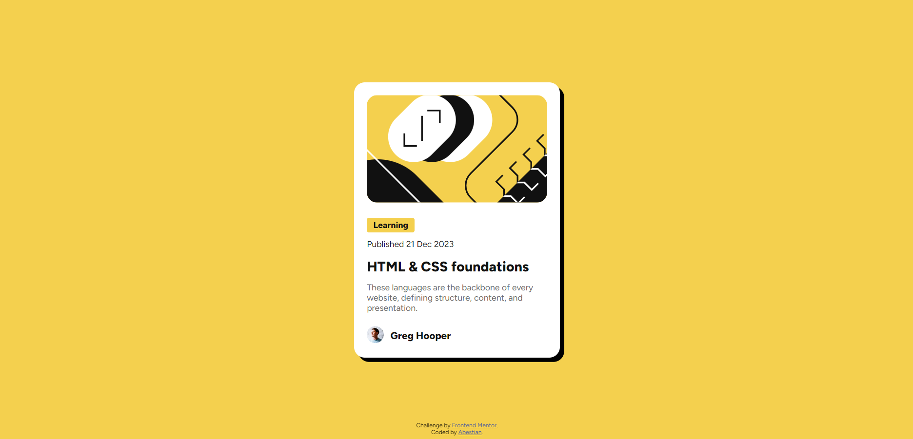
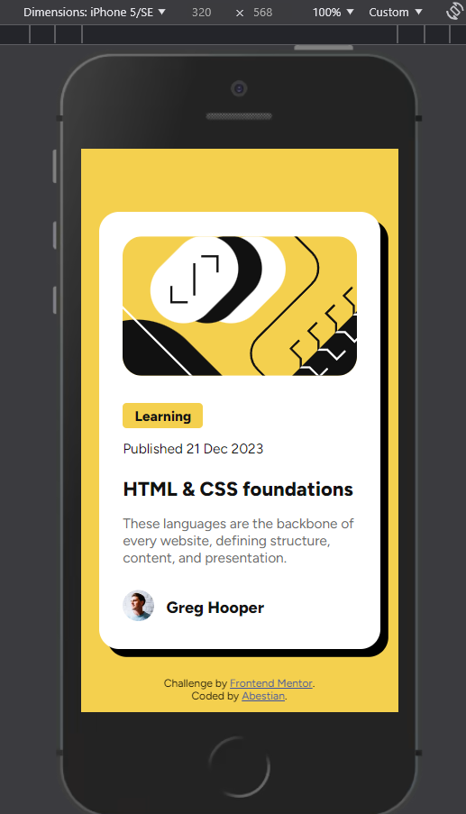

# Frontend Mentor - Blog preview card solution

This is a solution to the [Blog preview card challenge on Frontend Mentor](https://www.frontendmentor.io/challenges/blog-preview-card-ckPaj01IcS).

## Table of contents

- [Overview](#overview)
  - [The challenge](#the-challenge)
  - [Screenshot](#screenshot)
  - [Links](#links)
- [My process](#my-process)
  - [Built with](#built-with)
  - [What I learned](#what-i-learned)
  - [Continued development](#continued-development)
- [Author](#author)

## Overview

### The challenge

Users should be able to:

- See hover and focus states for all interactive elements on the page

### Screenshot

### Links

- Solution URL: [GitHub Repo](https://github.com/Abestian/blog_preview_card-FM)
- Live Site URL: [Live Site](https://abestian.github.io/blog_preview_card-FM/)

## My process

### Built with

- Semantic HTML5 markup
- CSS custom properties
- Flexbox
- Mobile-first workflow

### What I learned

While working on this project I've refreshed my memory of clamp function, which allows us to set a font-size that shrinks and grows along with the site's width. Thanks to this I didn't have to use media queries in this project at all and still achieve a proper card and text responsiveness.

[Check out clamp!](https://developer.mozilla.org/en-US/docs/Web/CSS/clamp)

### Continued development

In case of further development I still need to work on my mobile-first workflow, as I often tend to jump straight to coding the desktop view.

## Author

- Website - [Abestian](https://github.com/Abestian)
- Frontend Mentor - [@Abestian](https://www.frontendmentor.io/profile/Abestian)
